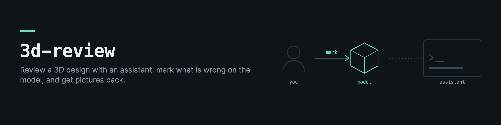

# 3d-review

3d-review is what I used to review a 3D design together with an AI assistant, while designing a 3D-printed toy. The person shows what is wrong on the model itself, the assistant answers with pictures, and the assistant has to prove that what the person asked for is still true after every rebuild.

It has four parts, and each one can be used alone.

- **The bench** is a web page that shows the model's stages. The person picks a part, moves or turns a ghost of it, marks a spot, writes what is wrong and submits. Each submission keeps the before and after pictures, the exact transform and the words, and becomes a thread the assistant answers. Replies are drawn from the person's own camera. "Publish all" notifies the assistant once for everything new.
- **The ledger** records which step of a build pipeline moved or rebuilt a part the person cares about, including code that runs between two steps. A placement the person locked stays locked, or the ledger says which line moved it.
- **The board** has one row per thing the person asked for, each with a measurement and a bar. A planted fault proves each row can go red, so a green board is not a green check over a hole.
- **The Penpot bridge** pushes 2D outlines in millimetres into a self-hosted Penpot file and reads the person's edits back.

## Install

```bash
pip install 3d-review
pip install "3d-review[penpot]"    # adds shapely, for cutting outlines in the Penpot bridge
```

In Python it is imported as `review3d`. It uses [3d-base](https://github.com/drkostas/3d-base) for pictures.

## The bench

```bash
3d-review stages body.stl arm.stl wheel.stl -o model     # writes model/stages.json and model/stages/parts.glb
cp "$(python -c 'import review3d,os;print(os.path.dirname(review3d.__file__))')/bench/bench.example.toml" model/bench.toml
3d-review bench --config model/bench.toml --port 8766
```

Then open `http://localhost:8766/twist.html`. `threads.html` lists every thread. From Python, `review3d.stages.write_stages` writes any number of stages (for example "parts", "assembled" and "printed") from `{stage: {part: trimesh.Trimesh}}`, and `review3d.bench.server.Bench` takes your own notifier, rebuild hook and freshness check. The default notifier appends a line to a file, so the assistant can watch that file.

The bench never changes the model. A submission is a request, and applying it is a separate step.

## The ledger

```python
from review3d import ledger
import mybuild

ledger.install(mybuild, watch={"arm", "wheel"}, pipeline="build")
mybuild.build()
print(ledger.missing(mybuild, "build"))   # steps the pipeline calls that the ledger does not wrap
ledger.write("ledger.json")
```

The steps are read from the pipeline's own source, so a step added later is never invisible to it. Moves are measured exactly (the rigid transform between the vertices before and after), and a part whose vertex count changed is reported as rebuilt.

## The board

```python
import types
import trimesh
from review3d.board import Board, Row, at_most, mirror_asymmetry

design = types.SimpleNamespace(body=trimesh.load("part.stl"))   # any object your rows can read

board = Board([Row("symmetric", "the two sides match", lambda d: mirror_asymmetry(d.body, normal=(1, 0, 0)), at_most(0.2), "mm")])

@board.fault("symmetric")
def bump(design):
    lump = trimesh.creation.box(extents=(2, 2, 2))
    lump.apply_translation([6, 0, 0])
    design.body = trimesh.util.concatenate([design.body, lump])

board.report(design)
print(board.proof_table(board.prove(design)))
```

A row whose measurement fails or has no input reads unknown, never green. A row with no fault reads unproven. The measurements include mirror symmetry, sphericity, surface roughness, gap and penetration between parts, tipping, first-layer area, overhang share, length along an axis, axis angle, bow, out of round, tunnels, and the brightness of a rendered view.

## The Penpot bridge

```python
from review3d.penpot import PenpotClient, PenpotSettings

client = PenpotClient(PenpotSettings.load("penpot.toml"))   # or PENPOT_* environment variables
result = client.push({"plate": [(0, 0), (60, 0), (60, 20), (0, 20)]})
edited = client.pull(file_id=result.file_id)
```

One Penpot unit is one millimetre. Keep credentials in the settings file or the environment, never in code.

## Claude Code skill

```bash
3d-review skill            # copies it to ~/.claude/skills/3d-review
```

The skill is the review loop as we ran it. It covers writing the person's requirements as rows before building, proving each row, answering threads with pictures, keeping locks through rebuilds, asking questions with pictures on the bench instead of in words, and the failures that taught each rule.

## Limits

- The bench is meant for one person and one assistant on a trusted network. It has no login, so keep it on `127.0.0.1` or behind a private network.
- The board's measurements are general. The rows that matter for your design are yours to write.
- The bench includes three.js r169 (MIT, licence in `bench/static/vendor`).
- Reading through Penpot's exporter depends on the exporter service working. The default `pull` reads the stored geometry and does not need it.

## Development

```bash
python -m venv .venv && .venv/bin/pip install -e '.[test,penpot]'
.venv/bin/pytest
```

The Penpot tests use a fake server. Set `PENPOT_URL` and a token to run the live round trip too.

## License

MIT
